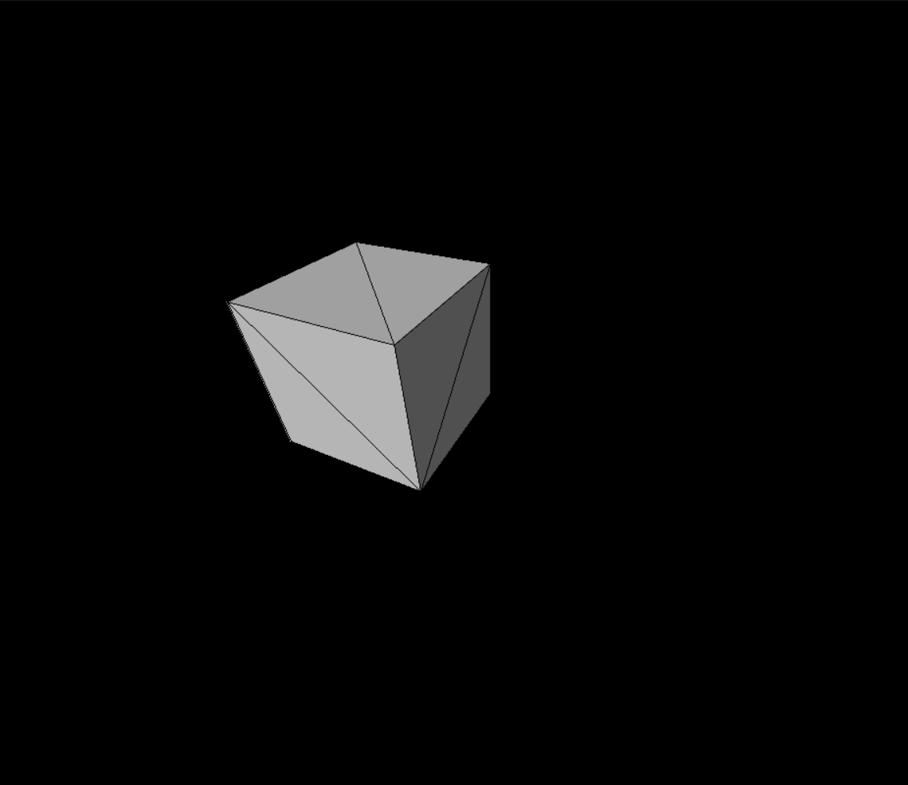

# boz_game_engine

A rasterizer that renders an 3D object using perspective projection.

Here is how it renders a rotating cube:  

*This project compiles on MS VC compiler.*

# Dependency

SDL library (version SDL2-2.0.12)

